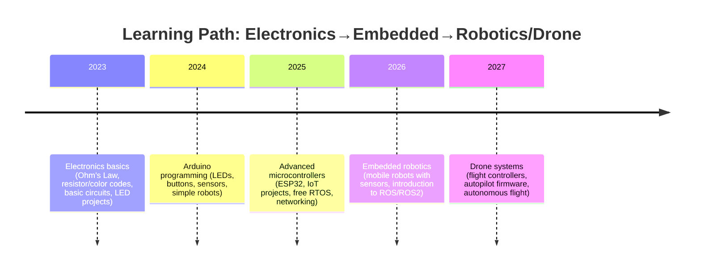

# Executive Summary  
A structured learning path from basic electronics through embedded systems to drones/robots involves textbooks, courses, tutorials and hands‑on projects. Begin with electronics fundamentals – Ohm’s law, passive components and circuit analysis – using free/open textbooks (e.g. *Lessons in Electric Circuits*【34†L95-L100】) and well-known guides (Grob’s *Basic Electronics*, Mims’ *Getting Started in Electronics*, Platt’s *Make: Electronics*, Scherz & Monk’s *Practical Electronics for Inventors*, etc.). Simultaneously, learn breadboarding and multimeter skills. Next, study microcontrollers: start with Arduino (official tutorials and “Getting Started” guides) and C programming, then advance to higher‑power boards (ESP32, Raspberry Pi Pico, etc.). Explore official documentation (Arduino.cc and Espressif’s ESP-IDF guides【27†L70-L79】【27†L86-L90】) and MOOCs (e.g. UT Austin’s **Embedded Systems: Shape the World**【23†L53-L60】, Coursera’s Arduino courses【84†L178-L184】, MIT’s *Circuits and Electronics*). Gradually add sensors and actuators: servo motors, ESCs, DC/stepper motors with drivers, inertial sensors (MPU‑6050), ultrasonic sensors, etc., using hobbyist tutorials (e.g. Adafruit Learning Guides【83†L211-L219】) and datasheets. Finally, tackle robotics and drones: learn ROS basics【49†L46-L54】【49†L54-L60】 for software, and open-source autopilots (ArduPilot/PX4【88†L30-L37】) for flight control. Build integrative projects (line‑follower robot, quadcopter) with detailed wiring diagrams and code steps. 

Each learning stage includes recommended resources (textbooks, courses, forums) and hands-on projects. We provide comparative tables of books and courses, a parts sourcing table (component vs. cost/vendor), step‑by‑step project guides (with parts lists and wiring), and timelines. **Primary sources and official docs** are cited throughout (e.g. Arduino and Espressif docs【27†L70-L79】【81†L81-L89】, academic texts【34†L95-L100】【23†L53-L60】). Active communities (StackExchange, Reddit, Arduino/Espressif forums) are noted for support.  

# 1. Foundations of Electronics  

**Textbooks & Online Texts (Free/Paid):** Solid theory is crucial. Recommended classics include *Lessons in Electric Circuits* (free CC‑licensed by Kuphaldt) covering DC, AC, semiconductors and more【34†L95-L100】, Grob’s *Basic Electronics*, Sedra/Smith’s *Microelectronic Circuits*, and Horowitz & Hill’s *The Art of Electronics*. For beginners, books like Forrest Mims’ *Getting Started in Electronics* or Charles Platt’s *Make: Electronics* offer intuitive, hands‑on introductions. Scherz & Monk’s *Practical Electronics for Inventors* is an accessible intermediate reference. Many such textbooks have companion websites or free preview material; e.g. *All About Circuits* (Kuphaldt) is available online【34†L95-L100】.  

- *All About Circuits / Lessons in Electric Circuits* – free online textbook (DC, AC, diodes, transistors, op-amps)【34†L95-L100】.  
- *Make: Electronics* (Platt) – project‑based intro (students build circuits early on).  
- *Getting Started in Electronics* (F. Mims) – illustrated beginner guide with simple experiments.  
- *Practical Electronics for Inventors* (Scherz & Monk) – broad coverage, many examples.  
- *The Art of Electronics* (Horowitz & Hill) – detailed reference (best for advanced study).  
- *Fundamentals of Electric Circuits* (Alexander & Sadiku) – good theory text.  

Many electronics tutorials/websites supplement these: e.g. **electronics-tutorials.ws** (free tutorials on resistors, capacitors, transistors, op-amps, etc.) and **Electronics-Tutorials.com**. For online courses, MITx *Circuits and Electronics* (6.002) on edX and Georgia Tech’s *Fundamentals of Electronics* (MOOC) teach circuit analysis and components. MITx’s course page confirms the scope and methods taught (though content must be accessed via edX)【86†L0-L2】.  

**Key Concepts:** Ohm’s Law, series/parallel networks, Kirchhoff’s laws, Thevenin/Norton models, RCL behavior, diode/Kirchhoff laws, transistor biasing. Build prototypes on breadboards; learn to read component color codes and datasheets (understand resistor tolerances, capacitor types/ESR, diode Vf, transistor β/hFE). Many hobbyist guides (e.g. SparkFun’s tutorials, or *All About Circuits* chapters) explain how to interpret datasheet parameters.   

**Component References:** Create or consult concise cheat-sheets for passive components. For example, RS Components’ *Complete Guide to Resistors* provides resistor selection basics【37†L1-L4】, while TI’s “Op Amps for Everyone” (free PDF) covers op-amp usage. Store datasheets from manufacturers (OnSemi, STMicro, Vishay) for semiconductors (logic gates, power ICs). Magnetic components (motors, coils) are usually prototyped by experimentation. Many popular ICs (555 timer, 74HCxx logic, LM358 op-amp) have tutorial application notes in datasheets or by Texas Instruments and Microchip.  

**Self-study Projects:**  
- **Blinking LED**: An LED + 220Ω resistor on Arduino pin (digital out) to show LED blink code. (Parts: Arduino or MCU, LED, resistor, breadboard.) Example wiring diagram: 【64†embed_image】 *Figure: Breadboard wiring for blinking LED (Arduino digital pin → resistor → LED → GND).*  
- **Resistor LED Matrix**: Multiple LEDs/resistors on digital outputs to build patterns.  
- **Voltage Divider and Potentiometer**: Build a variable voltage divider and measure with a multimeter.  
- **Diode Tester**: Use a multimeter (diode mode) on an LED or simple rectifier circuit.  
- **Simple Amplifier**: Transistor (2N2222) amplifier with collector load (learn biasing).  

Each project solidifies understanding: e.g. calculating resistor values, reading voltages, safe current limits, verifying with meter.  

# 2. Microcontroller Platforms  

## Arduino Ecosystem  
**Official Docs & Tutorials:** Arduino’s official website and documentation (docs.arduino.cc) provide a wealth of information. The **Arduino Uno R3** is highlighted as “the best board to get started”【81†L81-L89】. The docs note UNO’s specs: ATmega328P MCU (16 MHz, 32 KB Flash, 2 KB RAM, 1 KB EEPROM), 14 digital I/O (6× PWM), 6 analog inputs, USB interface, power jack, etc【81†L81-L89】. An interactive pinout and schematic are available for download【81†L67-L75】. Arduino’s *Getting Started* page and built-in examples guide first programs (LED blink, digital read, etc.). Arduino.cc has an entire Tutorials section (hundreds of community tutorials).  

**Textbooks & Guides:** Recommended books include *Getting Started with Arduino* (Massimo Banzi) and *Arduino Cookbook* (Margolis) for Arduino-specific learning. Online, Adafruit’s **Arduino Lesson series** covers basic projects (e.g. controlling LEDs, servos, motors)【83†L211-L219】. For example, Adafruit’s Lesson 14 shows servo control: “In this lesson you will learn how to control a servo motor using an Arduino… first get the servo to sweep back and forth”【83†L211-L219】. These step-by-step guides (with wiring diagrams) are excellent for beginners.  

**Online Courses:** Coursera’s *Arduino Platform and C Programming* (UCI) introduces Arduino hardware, the IDE, C language basics, I/O control, and serial comms【84†L178-L184】. Its modules cover the IDE, C programming fundamentals, and Arduino sketches (setup/loop) in depth. Another notable course is *Embedded Systems: Shape the World* (UT Austin on edX), which uses ARM MCUs but teaches general embedded concepts (a free ebook is available)【23†L53-L60】. For video learning, free YouTube series (e.g. Jeremy Blum’s Arduino tutorials, *Core Electronics* channel, or "Arduino for Beginners" series) can be useful.  

**Community:** The Arduino Forum (forum.arduino.cc) is a prime peer-support hub. Additionally, *Arduino StackExchange* (arduino.stackexchange.com) and Reddit’s r/arduino are active Q&A communities. For code sharing, GitHub hosts many Arduino libraries.  

## ESP32 and Advanced MCUs  
**Official Resources:** **Espressif Systems** provides the ESP-IDF Programming Guide (online docs) for ESP32 series. The guide’s *Get Started* page notes ESP32’s features: dual-core 32-bit MCU, Wi‑Fi, Bluetooth, ULP co-processor, rich I/O and peripherals【27†L70-L79】. It emphasizes Espressif’s IoT focus: “development framework by Espressif is intended for IoT applications with Wi-Fi, Bluetooth, power management, etc.”【27†L86-L90】. The official docs site (docs.espressif.com) includes hardware manuals, API references, and sample code. Espressif’s **Learn Web** pages and GitHub repos also offer examples.  

**Learning Materials:** For beginners to ESP32, MicroPython or Arduino core on ESP32 can simplify programming. Recommended books include *Programming the ESP32* (by Neil Kolban) and maker-genre books like *Exploring Arduino* (with ESP32 chapters). Online, Espressif publishes *Getting Started* tutorials for ESP32 (C and MicroPython). Many blogs (e.g. Random Nerd Tutorials) and YouTube channels (e.g. Andreas Spiess’s ESP32 series) offer project-based ESP32 guides (sensors, IoT demos).  

**Courses:** Few formal MOOCs focus on ESP32, but related IoT courses (Coursera, Udemy) often use it. One example: an IoT specialization on Coursera by UC Irvine includes Arduino and ESP32 modules. Espressif also offers free online training videos and webinars.  

**Community:** The Espressif Forum (en.community.espressif.com) and ESP32 subreddits (r/esp32, r/micropython) are active. StackExchange’s Electronics site and communities like Stack Overflow have many ESP32 Q&A.  

# 3. Actuators & Sensors  

**Servos and Motors:** Learn to use standard hobby servos (e.g. TowerPro SG90 micro-servo) and DC motors. Adafruit’s lesson【83†L211-L219】 and SparkFun tutorials show wiring: servos have 3 wires (V+, GND, PWM signal); DC motors use H-bridge drivers (L293D, L298N, or modern driver modules) for speed/direction control. Building projects like a **two-servo robot** introduces PWM signals and power supplies. (For example, Continuous Servo Robo diagrams show two servos controlled by Arduino PWM pins.) Always power motors from separate supply (not the Arduino 5 V pin) when drawing >200 mA.  

**ESCs (Electronic Speed Controllers):** For brushless motors (as in drones), use ESCs. Typical 30–40 A ESCs (e.g. Hobbywing) cost ~$15–20 each. ESCs accept standard RC PWM signals (or OneShot) from a flight controller or Arduino. Practice by connecting a brushless motor + ESC + battery on a bench. Key safety: propellers off until code tested!  

**Sensors:** Common sensors include: 
- **Ultrasonic (HC-SR04)** for distance (~$2–3) – 4 pins (Vcc, Trig, Echo, GND) and simple pulse timing.  
- **Infrared reflectance (line sensors)** for line following (LED + LDR/phototransistor pair).  
- **Inertial (MPU-6050)** – 6DOF gyro+accel on I²C, inexpensive (~$3). Essential for balancing robots/drone stabilization.  
- **Magnetic (compass)** and **barometric (BMP280)** sensors for navigation.  
- **Light (LDR or TSL2591)**, **temperature (DHT11/DHT22)**, **gas sensors**, etc. Adafruit and SparkFun publish hookup guides for these.  

Refer to datasheets for pinouts and power requirements. E.g. HC-SR04 datasheet shows trigger/echo timing; MPU-6050 datasheet shows register maps. Many hobby guides explain reading these sensors in code.  

**Component Reference Sheets:** Create quick reference tables (e.g. color-code chart, voltage ratings of common capacitors, motor torque/power, etc.). Hobbyist kits often include an “electronic components” pamphlet. For LEDs, note forward voltage (2 V red, 3.3 V blue) and current (~20 mA). For switches/relays, note coil voltage and current.  

# 4. Robotics & Drone Systems  

**Robotics Overview:** For general robotics, the Robot Operating System (ROS) is widely used in academia and industry. ROS is a message‑passing framework (not an OS) for integrating sensors, control, and vision【49†L46-L54】【49†L54-L60】. (For example, Clearpath’s guide defines ROS as “BSD-licensed system for controlling robotic components… using a publish/subscribe messaging model”【49†L46-L54】, where nodes on PC/embedded platforms communicate over topics.) Begin with ROS tutorials to learn nodes, topics, and tools (rviz, Gazebo). Official docs and community (ROS Wiki, ROS Answers) provide guidance.  

For embedded robotics, start with microcontroller projects: e.g. **line-following or obstacle-avoidance robots** using Arduino (two DC motors with driver, sensors, chassis). Many kits and Instructables exist for these. In parallel, learn about motor control algorithms (PID, differential drive kinematics).  

**Drone/UAV Systems:** Building a quadcopter/drone involves: frame, motors+propellers, ESCs, flight controller (FC), battery, RC transmitter/receiver, and sensors. Common FCs include Pixhawk (runs PX4 or ArduPilot) or small controllers like Matek/Omnibus (runs Betaflight). Key open-source autopilots are **ArduPilot** and **PX4**. ArduPilot’s site describes it as a “trusted, versatile, open source autopilot… supporting many vehicle types: multi-copters, helicopters, fixed wing, boats, submarines, rovers…”【88†L30-L37】. It notes hardware is open and community-driven【88†L30-L37】【88†L123-L126】.  

Recommended steps: (1) Learn basic flight controllers: e.g. use Betaflight or iNav on a small quad to understand ESC calibration and stabilization. (2) Study attitude sensing: use an IMU (gyro/accel) in code; practice simple stabilization loops on Arduino (or try ArduPilot’s “Basic Setup” docs). (3) Advanced navigation: GPS modules and mission planning (ArduPilot Mission Planner).  

**Key Resources:** ArduPilot’s Developer Guide and discussion forum are invaluable for code and hardware info【88†L30-L37】. PX4’s docs and community (discuss.px4.io) are alternative. For small educational drones, consider kits like Parrot or DIY drone kits (e.g. DJI clones or 3D-printed frames).  

**Community/Forums:** Active communities include DIYDrones, ArduPilot Discuss, PX4 forums, RCGroups (multirotor section), and r/drones on Reddit. Robotics.SE and ROS Discourse (discourse.ros.org) are Q&A hubs. For design inspiration, browse Hackaday.io projects and GitHub repositories.  

# 5. Learning Path, Timeline, and Projects  

**Progression Timeline:** A sample timeline for a motivated learner might be:

This spans months to years depending on pace; each phase includes ~1–3 months of study plus projects.  

**Starter Projects (with parts lists & milestones):** Below are example builds at each stage:

- **(a) LED Blinker / Traffic Light:** *Beginner (1–2 days)*. Parts: Arduino (or any MCU), breadboard, LEDs (3× different colors), 220 Ω resistors. Wiring: each LED anode → digital pin (e.g. 2,3,4) via resistor; cathodes to GND【64†embed_image】. Milestones: write code to blink one LED; then sequence through colors (like a traffic light). Outcome: familiarity with I/O pins, digitalWrite, delay loops.

- **(b) Push-Button Input:** *Beginner (1 day)*. Add a push-button and pull-down resistor. Parts: as above + pushbutton + 10 kΩ resistor. Wiring: button between digital pin and 5 V; resistor to GND. Milestones: code reads button (digitalRead) and toggles LED. Outcome: understand input circuits, pull-ups/pull-downs.

- **(c) Servo Sweep:** *Beginner (1 day)*. Control a servo. Parts: Arduino, servo (e.g. SG90), breadboard, jumper wires, external 5 V supply. Wiring: servo red→5 V, brown→GND, orange wire→Arduino PWM pin (e.g. 9). Use external 5 V supply ground common. Code: Arduino `Servo` library to sweep 0–180°. Outcome: learn PWM signal and using libraries (see Adafruit guide【83†L211-L219】).

- **(d) Motor Control (H-bridge):** *Intermediate (2–3 days)*. Drive two DC motors. Parts: Arduino, L293D or L298N motor driver, two DC motors (with wheels), 9 V battery or battery pack, breadboard. Wiring: Driver inputs to Arduino digital pins; motors to driver outputs; battery to driver Vcc. Milestones: spin motors forward, reverse, and implement simple line-follow (using IR sensor kits). Outcome: grasp motor drivers, H-bridge logic, dual motor coordination.  

- **(e) Sensor Integration:** *Intermediate (2 days)*. Add sensors (e.g. ultrasonic HC-SR04). Parts: Arduino + HC-SR04 module, jumper wires. Wiring: HC-SR04 Vcc to 5 V, GND to ground, Trig/Echo to two digital pins. Code: pulse Trig and measure Echo to compute distance. Combine with previous robot to avoid obstacles. Outcome: handling timing, interrupts (if used), and mapping sensor to action.

- **(f) Line-Follow Robot:** *Advanced (1–2 weeks)*. Build a simple differential-drive robot. Parts: Arduino (or two), motor driver, 2× DC motors, 2× IR line sensors (LED+LDR or ready-made), chassis (e.g. DIY or kit), caster wheel, battery pack. Wiring: motors to driver; line sensors to analog or digital pins. Milestones: code to read sensors and adjust motor speed (via PWM) to follow a black line on white surface. Outcome: integrated hardware, closed-loop control (basic feedback), extended code.

- **(g) Quadcopter/Drone Assembly:** *Advanced (>2 weeks)*. Using open-source flight controller (e.g. Pixhawk or STM32 F4 board with Betaflight). Parts: Frame (3D-printed or pre-made), 4 brushless motors, 4 ESCs, flight controller, battery (LiPo), RC transmitter/receiver, props, assorted sensors (IMU onboard FC). Wiring: follow flight controller manual (power distribution, ESC signal wiring). Milestones: configure flight controller firmware, perform hover test, and attempt simple manual flight. (Building fully autonomous drone is much more advanced.) Outcome: experience with UAV hardware integration, tuning PID, and flight testing. Documentation: refer to guides from ArduPilot/PX4 or Betaflight wiki.  

Each project builds practical skills. For each, create a **parts list** (component + quantity), a **wiring diagram** (as above or using Fritzing sketches), and **step-by-step code tasks** (outline, compile, test). Keep code modular (e.g. functions for sensor reading, motor drive) to reuse in later projects.  

# 6. Parts Sourcing and Suppliers  

| Component                     | Typical Cost (GBP)   | Suggested Vendors                   |
|-------------------------------|----------------------|-------------------------------------|
| Arduino Uno R3 board         | ~£20–25 (official)【51†L282-L290】 | Arduino.cc/store, Farnell, RS, Amazon (clones) |
| ESP32 Dev Board (WROOM)       | ~£6–10              | Farnell, Mouser, AliExpress, Amazon |
| Raspberry Pi Pico (RP2040)    | ~£4–6               | Pimoroni, Adafruit, Farnell         |
| Assorted resistor kit (5% 1/4W, 140+ pcs) | ~£5     | Farnell, RS, Mouser, Amazon         |
| Assorted capacitor kit        | ~£5–10              | Farnell, RS, DigiKey, eBay          |
| LEDs (5mm assorted pack 20)   | ~£2–5               | Mouser, RS, Amazon                  |
| Breadboard + jumpers          | ~£5–10              | Amazon, Adafruit, local electronics shops |
| Servo (e.g. SG90)             | ~£3                 | Amazon, eBay, Hobbyking, Adafruit   |
| DC Gearmotor (90 RPM, 6V)     | ~£4–6 each         | Pololu, Hobbyking, Amazon           |
| Stepper motor (28BYJ-48) + driver | ~£4             | Amazon, eBay, AliExpress            |
| ULN2003 driver (for stepper)  | ~£1–2               | Amazon, Farnell                     |
| Motor driver (L293D or L298N module) | ~£2–5        | Amazon, SparkFun, Farnell           |
| HC-SR04 ultrasonic sensor     | ~£2–3               | Amazon, eBay, AliExpress            |
| MPU-6050 6DOF IMU             | ~£3–4               | Amazon, eBay, AliExpress            |
| 9V battery & holder           | ~£2–4               | Farnell, RS, Maplin                 |
| Li-ion 18650 cell (2600mAh)   | ~£5 each           | Amazon (Panasonic), local battery stores |
| LiPo battery (11.1V 2200mAh)  | ~£15–25             | Hobbyking, Amazon, local hobby shop |
| ESC (30A BLHeli controller)   | ~£15–20 each       | Hobbyking, Amazon, Hobbywing        |
| Brushless motor (KV~2300)     | ~£10–15 each       | Hobbyking, Amazon, GearBest         |
| Propellers (pair, 9×4.5″)     | ~£2–5 per pair     | Hobbyking, Amazon, local hobby shop |
| Misc (jumper wires, headers)  | ~£5                | Amazon, eBay, Adafruit             |

*Prices are approximate street prices (2026). Suppliers:* Global distributors (**Farnell/element14**, **RS Components**, **Mouser**, **DigiKey**) stock quality parts in small quantities. For hobbyist kits, Adafruit and SparkFun offer curated kits (though pricier). Online marketplaces (Amazon, eBay, AliExpress) have cheap modules but buyer beware on quality. In the UK and India (Mumbai), Farnell and RS have local branches; Indian hobby stores like **Robu.in**, **Tenet**, or **HobbyPCB** can be useful. For 3D-printed parts (drone frames, robot chassis), Thingiverse models or commercial frames (e.g. DJI clones) are available.  

# 7. Learning Resources Comparison  

**Books and Courses:** See table below for key resources, their level, cost, format, and pros/cons.

| Title/Resource                         | Level        | Type         | Cost         | Pros/Cons                                        |
|----------------------------------------|-------------|--------------|--------------|--------------------------------------------------|
| *Lessons in Electric Circuits* (Kuphaldt)【34†L95-L100】 | Beginner → Advanced | Book (free PDF/web) | Free         | Comprehensive, sequential (DC→AC→SEMIC), well‑explained; somewhat text‑heavy. |
| *Make: Electronics* (Platt)            | Beginner    | Book         | £20–25       | Hands-on experiments, intuitive; not comprehensive theory, no appendices. |
| *Practical Electronics for Inventors* (Scherz & Monk) | Beginner→Intermediate | Book         | £40–45       | Covers wide topics, practical tips; not free, heavier focus on theory. |
| *Getting Started with Arduino* (Banzi) | Beginner    | Book         | £15–20       | Good intro to Arduino and simple projects; some outdated parts. |
| *Arduino Cookbook* (Margolis)          | Intermediate | Book         | £30–40       | Recipe‑style projects, comprehensive Arduino functions; pricey. |
| *Embedded Systems – Shape the World* (Valvano)【23†L53-L60】 | Intermediate | Book (free)  | Free (CC-BY-NC) | ARM MCU focus, embedded C; uses TI LaunchPad. Prereq: C programming. |
| Coursera: **Arduino Platform and C**【84†L178-L184】 | Beginner→Intermediate | MOOC (online) | Free enrolment (paid cert) | Structured modules on Arduino IDE/C; requires internet, QA support. |
| edX: MIT *Circuits and Electronics*   | Beginner→Intermediate | MOOC (online) | Free (audit) | Rigorous circuit analysis (MIT lectures); lacks Arduino context. |
| Coursera: *Intro to Programming IoT* specialization | Beginner    | MOOC        | Free enrolment | Covers Arduino, ESP32, networking; broad IoT context. |
| Adafruit Learning Guides (e.g. Servo Tutorial)【83†L211-L219】 | Beginner    | Online tutorial (free) | Free         | Clear step‑by‑step for hardware projects; limited depth per topic. |
| Arduino official **Tutorials**        | Beginner→Advanced | Online (free) | Free         | Hands-on examples, covers many boards; not cohesive curriculum. |
| SparkFun Learn pages                  | Beginner    | Online (free) | Free         | Project-based tutorials; shop-centric, but good schematics. |
| **ROS tutorials** (official)          | Beginner    | Online (free) | Free         | From ROS wiki/clearpath: cover install, nodes, basics【49†L46-L54】; aimed at Ubuntu/C++. |

*(Costs in GBP; MOOC costs refer to certificate fees if desired.)*  

# 8. Hands-On Milestones & Tips  

- **Stage Timing:** Beginners may spend ~1–2 months on basic electronics (5–10 hours/week), then a few weeks on introductory Arduino projects. Intermediate embedded/robotics (reading advanced texts, building robots) could take 3–6 months. Advanced (drones, ROS) is multi-month to years of study. These estimates vary with background and intensity.  

- **Learning Tips:** Balance reading with practical builds. For each new concept, do a small circuit or code snippet. Use breadboards first, then soldered prototypes. When reading datasheets, focus on key specs (voltage, current, timing) – you don't need to understand every detail on first pass.  

- **Community Support:** Post questions on Arduino or Electronics StackExchange with schematics. Use forums (Arduino.cc, Espressif, ROS Discourse) and subreddit communities (e.g. r/arduino, r/robotics, r/diydrones) to troubleshoot. Check StackOverflow for coding errors.  

# Sources  

Key references include official and high‑quality sources: Arduino’s own documentation【81†L81-L89】 and tutorials; Espressif’s ESP32 guides【27†L70-L79】【27†L86-L90】; the free embedded‑systems textbook *Shape the World*【23†L53-L60】; and community learning guides (Adafruit【83†L211-L219】, SparkFun). We also cite authoritative vendor pages (Arduino board spec【51†L282-L290】, and ArduPilot homepage【88†L30-L37】【88†L148-L150】) and educational resources (Clearpath ROS tutorial【49†L46-L54】【49†L54-L60】). All sources are in English and up-to-date as of 2026.